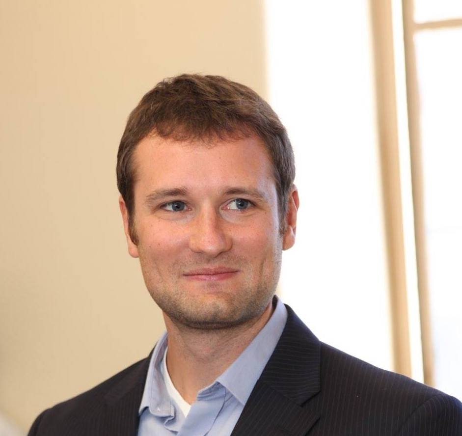

```{r setup, include=FALSE}
knitr::opts_chunk$set(echo = FALSE)
```


```{r picture, fig.width=1,fig.heigh=1}

```


 I am a biostatistician and licensed clinical neuropsychologist living in the San Diego area.  I received my PhD in Clinical Psychology from the University at Albany and completed my clinical internship in neuropsychology at the University of California, San Diego and VA San Diego.  I then completed postdoctoral fellowships at the University of California, San Diego and VA San Diego specializing in aging and dementia.  I recently became a Senior Biostatistician at Canopy Growth Corporation in the Human and Animal Research Program.  This blog is part documentation of my experience transitioning to industry and part tutorial on data science, all through the lens of R.  