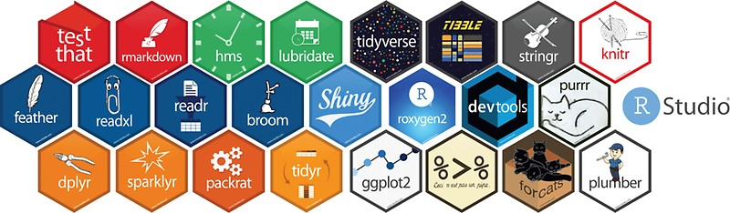

I'm often asked to recommend materials for learning R.  Fortunately, there are a lot of great resources out there.  Listed below are some of my favorites, but of course there are many, many others.  These are primarily geared towards beginner and intermediate R users.  I'll periodically update this list as I discover new materials.\

```{r picture,out.width="200%"}

```


## Learning R

[R for Data Science](https://r4ds.had.co.nz)\
[Hands-On Programming with R](https://rstudio-education.github.io/hopr/)\
[Data Science in a Box](https://datasciencebox.org/index.html)\
[R Cookbook](https://rc2e.com)\
[Kelly Bodwin's Youtube Channel](https://www.youtube.com/user/SuperKrazy2000)\


## Data Visualization

[ggplot2:  Elegant Graphics for Data Analysis](https://ggplot2-book.org)\
[R Graphics Cookbook](https://r-graphics.org)\
[From Data to Viz](https://www.data-to-viz.com)\
[ggplot2 workshop by Thomas Lin Pedersen](https://www.youtube.com/watch?v=h29g21z0a68)\


## R Markdown

[R Markdown: The Definitive Guide](https://bookdown.org/yihui/rmarkdown/)\
[R Markdown Cookbook](https://bookdown.org/yihui/rmarkdown-cookbook/)\

## R Books

This is a tremendous and well-organized compendium of books on R:  [Big Book of R](https://www.bigbookofr.com/index.html)  \

## GitHub

[Happy Git and GitHub for the useR](https://happygitwithr.com)\

## General Resources

[R Bloggers](https://www.r-bloggers.com)\
[R Cheatsheets](https://rstudio.com/resources/cheatsheets/)